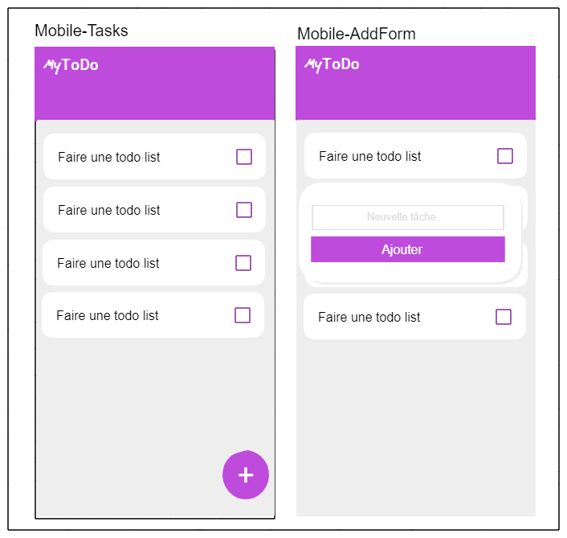

### Live version [here](https://react-todo-list-virginiebouvarel.vercel.app/)

# React-todo-list

## Détails

> Technos utilisées : React/CSS Modules

Pour ce projet mon objectif était de réaliser une simple ToDoList comme premier projet en React.
Les points techniques qui m'ont demandé le plus de réflexion concernent: la composition. Parvenir à découper une application même petite en composants, peut paraître simple de prime abord, mais c'est toute l'architecture logique qui en découle. Il faut donc trouver le bon dosage entre réflexion en amont et conception agile.  

Avec ce projet j'ai appris...

- que plonger dans les tutos, même encore aujourd'hui, est contreproductif, car engranger des techniques "théoriquement" seulement, fait se sentir ignorant.
- que passer le cap du projet from scratch est toujours libérateur et fait réemerger les compétences acquises.
- que découper judicieusement une application en composants est le fondement d'une bonne utilisation des frameworks front.
